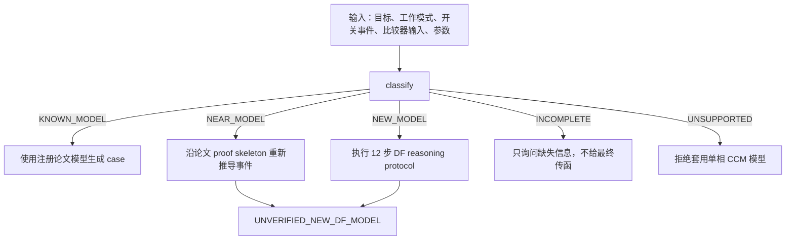

# Buck DF Transfer Functions

面向单相 CCM Buck 的描述函数（describing function, DF）推导 skill，覆盖 COT current-mode、external ramp、V²/RBCOT 与 loop gain。

v0.3 的重点不是宣称“任意 Buck 都能自动推导”，而是把推导过程约束成可审计的事件链：

```text
开关事件 F(x,u,t)=0
        ↓
边沿扰动 delta_t=-delta_F/Fdot_0
        ↓
等效开关函数扰动 d_hat
        ↓
a_c / a_g / a_o / a_i 或 direct transfer
        ↓
Buck 功率级联立与验证等级
```

如果比较器事件缺失，skill 只能分类并询问缺失信息，不能输出最终传函。新结构即使完整走完协议，也必须保持 `PROTOCOL_DERIVED_UNVERIFIED`，直到论文 benchmark 或开关仿真提供独立证据。

## 它解决什么问题

- 从物理参数生成四个已注册论文模型，不要求用户预先填写 `a_*`。
- 区分已知、相近、全新、信息不足和越界电路。
- 强制新模型写出 `F=0`、可移动边沿、`delta_t`、扰动路径与来源标签。
- 检查平均模型冒充 DF、无来源系数、虚假验证声明及不支持的工作模式。
- 在没有 Zotero 和论文 PDF 的电脑上复现公式、测试与离线 benchmark。

它不能仅凭一张 Bode 图或代数化简证明新传函正确。`df_protocol_checker.py` 检查的是协议完整性和声明诚实性，不是公式的物理正确性。

## 决策流程



## 支持的论文模型

| 模型 ID | 控制方式 | 接口 | 当前证据等级 |
|---|---|---|---|
| `cot-cm-li-lee-2010` | COT current-mode | `Fc/Fg/Fo → a_*` | `PAPER_GROUNDED_PARTIAL` |
| `cot-cm-external-ramp-tian-2015` | COT current-mode + linear external ramp | `Fc/Fg/Fo → a_*` | `PAPER_GROUNDED_PARTIAL` |
| `v2-cot-li-lee-2009` | V² COT capacitor-ripple control | paper direct `Gvc` | paper-grounded benchmark |
| `rbcot-esr-lu-2023` | ESR-ripple RBCOT loop gain | `Fdx/Fodx/Fox/Fp` | `PAPER_GROUNDED_PARTIAL` |

论文公式、适用范围和重排过程见 [DF coefficient library](references/df-coefficient-library.md)，来源与 DOI 见 [Zotero DF source map](references/zotero-df-source-map.md)，逐篇推理结构见 [paper proof skeletons](references/paper-proof-skeletons/)。

## 明确不支持

v0.3 不支持或不宣称支持：

- DCM、临界导通模式；
- multiphase overlap 或相位管理参与开关事件；
- pulse skipping、burst、饱和和非线性限流；
- 从电路图片自动识别比较器连接；
- 从任意 SPICE netlist 自动生成 DF；
- 把平均模型包装成描述函数；
- 把新推公式直接标成 verified。

Huang 2025 internal-ramp/DC-extractor 模型采用平均模型，因此在本 DF 注册库中标记为 `EXCLUDED_NON_DF`。

## 安装

### 安装为 Codex skill

PowerShell：

```powershell
git clone https://github.com/Liuxd-1230/deriving-buck-df-transfer-functions.git `
  "$HOME\.codex\skills\deriving-buck-df-transfer-functions"
```

更新已有安装：

```powershell
git -C "$HOME\.codex\skills\deriving-buck-df-transfer-functions" pull
```

在 Codex 中可直接请求：

```text
使用 $deriving-buck-df-transfer-functions，判断这个 COT Buck 应使用已知论文模型还是重新按事件协议推导。
```

### Python 依赖

核心符号工具需要 Python 和 SymPy；离线 benchmark 还使用 NumPy 与 Matplotlib：

```powershell
python -m pip install sympy numpy matplotlib
```

Zotero 不是运行依赖。论文 PDF 也没有打包进仓库。

## 快速开始

主要入口：`list-models`、`make-case`、`classify --intake`、`make-protocol-case`、`derive` 和 `df_protocol_checker.py`。

### 1. 已知论文模型

列出注册模型：

```powershell
python scripts/df_buck_sympy.py list-models
```

使用 Tian external-ramp 参数生成 case，并输出传函报告：

```powershell
python scripts/df_buck_sympy.py make-case `
  --model cot-cm-external-ramp-tian-2015 `
  --params benchmarks/tian2015_external_ramp/params.json `
  --out generated-tian-case.json

python scripts/df_buck_sympy.py derive `
  --case generated-tian-case.json `
  --out generated-tian-derivation.md

python scripts/df_buck_sympy.py check `
  --case generated-tian-case.json
```

这个路径复用已固化的论文公式；它不会要求用户手写 `a_c/a_g/a_o/a_i`。

### 2. 信息不足的电路

```powershell
python scripts/df_buck_sympy.py classify `
  --intake examples/intake_missing_event.json
```

输出应为 `INCOMPLETE`，并列出 `switching_events`、`comparator_inputs` 等缺失项。此时不允许生成最终传函。

### 3. 相近或全新结构

下面的示例类似 Tian external-ramp COT，但 ramp 由 RC 网络生成，因此不能直接套 Tian 的线性 ramp 系数：

```powershell
python scripts/df_buck_sympy.py classify `
  --intake examples/intake_new_rc_ramp_cot.json

python scripts/df_buck_sympy.py make-protocol-case `
  --intake examples/intake_new_rc_ramp_cot.json `
  --out protocol-case.json

python scripts/df_buck_sympy.py derive `
  --case protocol-case.json `
  --out protocol-derivation.md

python scripts/df_protocol_checker.py check-json `
  --case protocol-case.json

python scripts/df_protocol_checker.py check `
  --report protocol-derivation.md
```

该示例演示协议结构，不声称已经给出 RC-ramp 的闭式正确系数。必须重新求周期稳态 `vramp(t)`、总边沿斜率、边沿递推和 DF 路径，并保持 `UNVERIFIED_NEW_DF_MODEL`。

### 结构化主路径与当前自动化边界

`make-protocol-case → check-json` 是机器检查的结构化主路径。`check --report` 对 Markdown 做启发式解析，只是兼容人工报告的兜底入口；关键验收应以 JSON case 为准。

对于 `case_version=0.3`，`derive` 是报告渲染器：它不需要 SymPy，也不会自动把任意 `F(x,u,t)=0` 变成 `a_*`，更不会自动完成新结构的代数消元。当前责任划分是：

1. agent 按 12 步协议推导候选事件敏感度、DF 关系和传函；
2. protocol case 保存候选式、来源和未验证项；
3. checker 检查步骤完整性与声明诚实性；
4. 只有注册 v0.2 模型走现有 SymPy 功率级消元器。

把任意 protocol case 的合法 `a_*` 自动桥接到 Buck 矩阵消元，是后续版本功能，不属于 v0.3 已实现能力。

## Protocol checker 能抓什么

| 状态 | 含义 |
|---|---|
| `PASS_KNOWN_MODEL` | 使用注册模型 |
| `PASS_PROTOCOL_UNVERIFIED` | 协议链完整，但新模型仍未验证 |
| `WARNING_INCOMPLETE_VALIDATION` | 推导存在，但验证证据不足 |
| `FAIL_MISSING_EVENT` | 缺少 `F(...)=0` |
| `FAIL_MISSING_EDGE_PERTURBATION` | 缺少可移动边沿或 `delta_t` |
| `FAIL_UNSUPPORTED_TOPOLOGY` | 使用了越界结构 |
| `FAIL_FALSE_DF` | 平均模型被冒充为 DF |
| `FAIL_MISSING_DF_SOURCE` | 用户 `a_*` 缺少事件、来源或有效频率 |
| `FAIL_FALSE_VERIFICATION_CLAIM` | 证据不足却声称 verified/correct |

失败样例位于 [tests/protocol_failures](tests/protocol_failures/)。

## 验证证据

仓库包含四套离线 benchmark：

- Li/Lee 2010 COT current-mode；
- Tian 2015 external ramp；
- Li/Lee 2009 V²/RBCOT；
- Lu 2023 RBCOT loop gain。

运行全部测试与 benchmark：

```powershell
$env:PYTHONUTF8='1'
$env:PYTHONDONTWRITEBYTECODE='1'
$env:MPLBACKEND='Agg'

python -m unittest discover -s scripts -p 'test_*.py' -v
python -m unittest discover -s tests -p 'test_*.py' -v
python scripts/run_benchmarks.py --all
```

详细数值、假设和未验证项见 [VALIDATION.md](VALIDATION.md)。目前没有开关仿真验证任何新 protocol-derived 模型，也没有独立 agent forward-test 证据；静态 CLI 场景不能替代这两项。

## 目录结构

```text
SKILL.md                         Codex 执行规则
references/                      公式库、输入协议、schema、proof skeleton
scripts/                         模型生成、分类、协议 case、检查器
benchmarks/                      四套可离线复现的论文基准
examples/                        已知、缺事件、RC-ramp、overlap 示例
tests/                           v0.3 契约与失败样例
VALIDATION.md                    证据等级和未验证项
```

## 最重要的使用原则

1. 完全匹配注册模型时，优先复用论文公式。
2. 只要连接或 ramp 路径改变，就退回事件方程重新推导。
3. 没有 `F(x,u,t)=0`，不输出最终传函。
4. 协议检查通过只说明推导步骤完整，不证明传函物理正确。
5. 新模型在 benchmark 或开关仿真前始终保持未验证状态。
