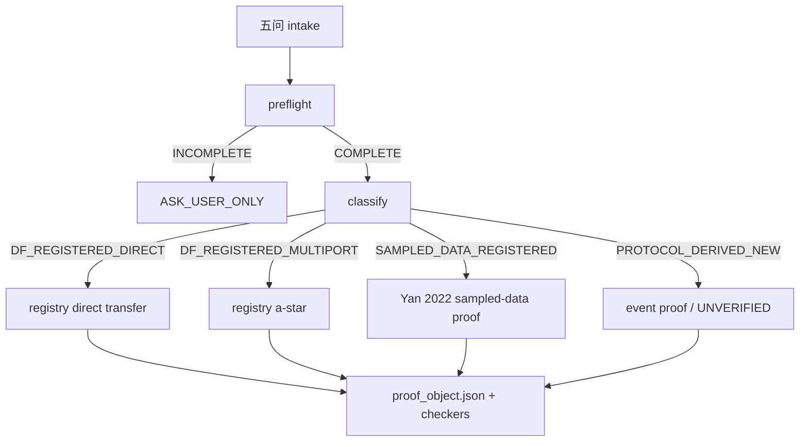

# Buck DF Transfer Functions

面向单相 CCM Buck 的物理优先小信号建模与论文公式审计 skill，覆盖 current-mode COT、external-ramp COT、V² COT、ESR-ripple RBCOT、`Gvc/Gvg/Zout/Tloop`、连续基波与边带。

## v0.5：从确认电路到 Hybrid Poincaré 模型

v0.5 与 v0.4.5 并行存在。用户原理图默认进入新的物理路径；旧 paper benchmark 继续走原 registry/proof 路径，命令与 artifact 保持兼容。

```text
IMAGE_INTAKE → CIRCUIT_IR_PROPOSED → TOPOLOGY_CONFIRMED
→ PHYSICS_SPEC_CONFIRMED → MODE_DAE → PERIODIC_ORBIT
→ HYBRID_LINEARIZATION → PHYSICS_CHECKERS
→ REGISTRY_CROSSCHECK → REPORT
```

v0.5 的物理真源是“用户确认且有内容哈希的 Circuit IR + Physics Spec”。模式方程由元件 stamping 自动生成 `E xdot = A x + B u + b`，保留 KCL/KVL、代数变量、储能状态和元件 provenance；周期轨道由分段仿射矩阵指数、guard root finding 与 shooting 求得；事件同时保存 common-time saltation matrix 与 event-to-event Poincaré projection。权威 `Ad/Bd` 使用后者，并由独立 `solve_ivp` 开关时域周期映射的中心有限差分复核。

物理硬门禁包括：缩放 KCL/KVL、周期固定点、伏秒、电荷和功率/能量残差 `<=1e-7`，解析/独立有限差分 Poincaré Jacobian 相对误差 `<=1e-3`，以及边带 `M=3→6→…→64` 的相邻截断变化 `<=0.1 dB/1°`。CCM 要求最小电感电流为正；Floquet 不稳定是可报告的真实物理结果，不是推导失败。

采样频响严格沿 `z=exp(jωTs)` 计算；模拟输出的连续基波由周期内分段变分方程提升并 Fourier 投影，边带频率为 `f+k*fs`。低频 s 域只由显式级数展开产生。L/C、负载、ESR/DCR、采样增益、ramp、Ton/Ts 与 delay 的灵敏度会在每个扰动点重新生成 MNA、重求轨道和事件线性化。

V² COT 首个金样使用 [原理图](examples/v05-v2-cot/schematic.svg)，四个确定性金样由 `scripts/v05_golden_cases.py` 生成。[图片 forward-test 清单](examples/v05-forward-tests.json) 另覆盖 current-mode、external-ramp、ESR-ripple RBCOT、同步 QH/QL 和无连接点的歧义交叉线。Li/Lee、Tian、Lu、Yan registry 只做公式、趋势、有效频段或边带交叉检查，不能替代用户电路的物理模型，也不会提升验证等级。

```powershell
python scripts/v05_golden_cases.py --family v2-cot `
  --image examples/v05-v2-cot/schematic.svg --registry-crosscheck `
  --out golden-inputs

python scripts/derive_physics_model.py `
  --circuit-ir golden-inputs/circuit_ir.json `
  --physics-spec golden-inputs/physics_spec.json `
  --out golden-result
```

成功结果使用 `PHYSICS_DERIVED_INTERNAL_VALIDATED` 或 `PHYSICS_DERIVED_EXTERNAL_CROSSCHECKED`。逐项强制继续会永久降级为 `FORCED_PHYSICS_OVERRIDE_UNVERIFIED`；显式 `gmin/rmin` 或 near-grazing secant 扫描始终为 `REGULARIZED_DIAGNOSTIC_UNVERIFIED`。skill 不会自动启动 SIMPLIS；用户上传外部数据时必须同时给出频率、幅值、相位、target、端口/符号、loop break、工作点和来源元数据。

v0.4.5 是 ESSF（Event–Sampling–Sideband Framework）的 typed linear equation transfer 版本。它继承 v0.4.4 的 Yan 2022 sampled-data registered path、sensing/validation policy、registered model applicability contract、RC-derived comparator ramp memory checker 与中文 artifact-driven report contract，并新增未验证 / protocol-derived 路径的线性方程系统生成层。它先建立不可绕过的 intake、formula registry 和 proof object 闭环，再把 Yan/Ruan/Li 2022 Part I/II 的 Dirichlet、sideband、COT/COFT 双脉冲和 zero-ramp `Fm` proof fragment 固化成可检查 artifact：

```text
INTENT_CLASSIFY → PREFLIGHT_INTAKE → MODEL_CLASSIFY
→ FORMULA_BINDING/proof_object.json → DERIVATION/derivation.json
→ CHECKERS/checker_result.json → REPORT
```

任一五问信息缺失时，固定返回 `INCOMPLETE → ASK_USER_ONLY`，不能推导、自选参数或画 Bode 图。对于 `workflow.intent == user-circuit-derivation`，缺少 `sensing_layer` 同样必须停在 `ASK_USER_ONLY`，不能自动选择 registered DF 或 `SAMPLED_DATA_REGISTERED`。显式 `custom_sensing_network`、`user_supplied`、`measured` 或未注册 sensing 只能进入 `NEAR_MODEL` / `AUDIT_REQUIRED` / `PROTOCOL_DERIVED_UNVERIFIED`，不得声明 paper-grounded。

v0.4.5 继续使用“双索引”分类：先按控制机理/建模方法判断 `current-mode`、`voltage-mode`、`V² COT`、`RBCOT`、`sampled-data`、ramp/delay/filter/multiphase 等 ontology，再绑定 Li/Lee、Tian、Lu、Yan 等 paper source，然后用 applicability contract 核对 sensing layer、comparator inputs、sampled variable、timing、target semantics、nonidealities 与 loop-break 语义。实践是检验真理的唯一标准；`SUBFORMULA_VERIFIED`、`CHAIN_VERIFIED`、`FIGURE_REPRODUCED`、`SIMULATION_OR_MEASUREMENT_REPRODUCED` 必须分开声明。`REFERENCE_TARGET_SEMANTICS_UNCLEAR` 会阻断 `FIGURE_REPRODUCED`，即使数值曲线接近。

v0.4.5 的报告层只从既有 artifact 渲染中文 Markdown：`intake_status.json`、`classification.json`、`proof_object.json`、`derivation.json`、`formula_origin.json`、`checker_result.json`、`bode_summary.json` 和 `mismatch_report.json`。`checker_result.json` 是统一检查入口，聚合 preflight、model classification、model applicability、proof/formula、linear equation system、variable role、block shape、denominator provenance、report formula rendering、normalization、power-stage dynamics、mismatch、forbidden claims、RC memory factor 和 validation policy。`report.md` 是人工二次 checkout 界面，不替代 JSON 证据源，也不能重新推导、补公式、推断隐藏默认值或升级 validation。

v0.4.5 的主 invariant 是：未验证 / protocol-derived 路径的 candidate transfer expression 只能由 `scripts/linear_system_transfer.py` 从 `linear_equation_system.json` 的 `active_equations` 消元生成。报告可以显示表达式，但不得构造、改写、化简或补全表达式。`diagnostic_equations` 只能用于报告、sanity check 或 provenance notes，不得影响 transfer expression；非平凡分母必须带 `denominator_provenance`，并标明来源方程和 solver-generated 状态。

## 它解决什么问题

- 从物理参数生成四个已注册论文模型，不要求用户预先填写 `a_*`。
- 用 `preflight_intake.py` 建立 intake 硬闸门。
- 区分 `DF_REGISTERED_DIRECT`、`DF_REGISTERED_MULTIPORT`、`PROTOCOL_DERIVED_NEW`、信息不足和越界电路。
- 区分 `SAMPLED_DATA_REGISTERED_PART_I_PCM_VCM_PVM_VVM`、`SAMPLED_DATA_REGISTERED_PART_II_CCOT_CCOFT`、`SAMPLED_DATA_REGISTERED_PART_II_VCOT_VCOFT`。
- 以拆分后的 `model_registry.yaml`、`formula_registry.yaml`、`paper_contract_registry.yaml` 和 `validation_registry.yaml` 作为注册事实源。
- 用 `check_proof_object.py` 和 `check_formula_consistency.py` 检查结构化证据。
- 用 `sampling/Fm/sideband/pulse_structure/modulator_io/target_mapping` 防止 sampled-data 推导把 `Tc/Gvc/Tloop` 混称。
- 强制新模型写出 `F=0`、可移动边沿、`delta_t`、扰动路径与来源标签。
- 检查平均模型冒充 DF、无来源系数、虚假验证声明及不支持的工作模式。
- 在没有 Zotero 和论文 PDF 的电脑上复现公式、测试与离线 benchmark。

它不能仅凭一张 Bode 图或代数化简证明新传函正确。`df_protocol_checker.py` 检查的是协议完整性和声明诚实性，不是公式的物理正确性。

## 决策流程



## 支持的论文模型与 sampled-data 注册路径

| 模型 ID | 控制方式 | 接口 | 当前证据等级 |
|---|---|---|---|
| `cot-cm-li-lee-2010` | COT current-mode | `Fc/Fg/Fo → a_*` | `PAPER_GROUNDED_PARTIAL`; current benchmark covers Eq. (9)-(10), not full Eq. (16) `Gvc` figure reproduction |
| `cot-cm-external-ramp-tian-2015` | COT current-mode + linear external ramp | `Fc/Fg/Fo → a_*` | `PAPER_GROUNDED_PARTIAL` |
| `v2-cot-li-lee-2009` | V² COT capacitor-ripple control | paper direct `Gvc` | paper-grounded benchmark |
| `rbcot-esr-lu-2023` | ESR-ripple RBCOT loop gain | `Fdx/Fodx/Fox/Fp` | `PAPER_GROUNDED_PARTIAL` |
| `yan-2022-part-i-pcm-buck` | PCM/VCM/PVM/VVM sampled-data | Dirichlet + sideband proof fragment | `SAMPLED_DATA_REGISTERED_PARTIAL` |
| `yan-2022-part-ii-ccot-buck-zero-ramp` | C-COT/C-COFT zero-ramp sampled-data | two pulse trains + `1-exp(-s*T0)` | `SAMPLED_DATA_REGISTERED_PARTIAL` |
| `yan-2022-part-ii-vcot-buck-zero-ramp` | V-COT/V-COFT zero-ramp sampled-data | `GPWM/Tv/Tc` mapping + trend boundary | `SAMPLED_DATA_REGISTERED_PARTIAL` |

前三个 Yan 模型不是旧 `make-case` 的 a-star DF 生成器。它们只能通过 `preflight → classify → build_proof_object → derivation → checkers` 进入报告。v0.4.5 的 Yan registered path 只注册论文主链路 `Gm/GPWM → Gid/Gvd → Ti/Tv → Tc`；`Gvc/Tloop/Gvg/Zout` 未作为 Yan 2022 benchmark 交付目标，必须拒绝或标为 unverified。

论文公式、适用范围和重排过程见 [DF coefficient library](references/df-coefficient-library.md)，来源与 DOI 见 [Zotero DF source map](references/zotero-df-source-map.md)，逐篇推理结构见 [paper proof skeletons](references/paper-proof-skeletons/)。

## 明确不支持

v0.4.5 不支持或不宣称支持：

- DCM、临界导通模式；
- multiphase overlap 或相位管理参与开关事件；
- pulse skipping、burst、饱和和非线性限流；
- 从电路图片自动识别比较器连接；
- 从任意 SPICE netlist 自动生成 DF；
- 把平均模型包装成描述函数；
- 2026 external-ramp C-COT dynamic `Fm(s)`；
- internal ramp、comparator delay、RC injection、sense filter；
- 多相 nonoverlap/overlap sampled-data；
- 把新推公式直接标成 verified；
- 在缺少 `sensing_layer`、比较器输入或目标语义时自动套用默认模型；
- 把低阶功率级路径描述为 full power-stage `Gvc` 或 `FIGURE_REPRODUCED`；
- 把 switch-node RC、sense filter 或 RC-derived comparator ramp 的 local slope 当作完整 `Kmod`。

Huang 2025 internal-ramp/DC-extractor 模型采用平均模型，因此在本 DF 注册库中标记为 `EXCLUDED_NON_DF`。Yan 2026 external-ramp 和多相论文属于 v0.5，不在 v0.4.5 半实现。

## 安装

### 安装为 Codex skill

PowerShell：

```powershell
git clone https://github.com/Liuxd-1230/deriving-buck-df-transfer-functions.git `
  "$HOME\.codex\skills\deriving-buck-df-transfer-functions"
```

更新已有安装：

```powershell
git -C "$HOME\.codex\skills\deriving-buck-df-transfer-functions" pull
```

在 Codex 中可直接请求：

```text
使用 $deriving-buck-df-transfer-functions，判断这个 COT Buck 应使用已知论文模型还是重新按事件协议推导。
```

### Python 依赖

v0.5 数值内核需要 Python、NumPy、SciPy 和 SymPy，图像 checkout/旧版 benchmark 还使用 Matplotlib：

```powershell
python -m pip install -r requirements.txt
```

Zotero 不是运行依赖。论文 PDF 也没有打包进仓库。0.4 系列开发阶段阅读了 Yan 2022 Part I/II PDF 来提取 proof skeleton、公式片段和 benchmark 边界；交付物只保留可执行 registry、proof object、benchmark 和短 provenance。

## 快速开始

主要入口：`preflight_intake.py`、`classify --intake-status`、`build_proof_object.py`、`derive_transfer.py`、`check_derivation.py` 和 `render_derivation_report.py`。

sampled-data registered 完整链：

```powershell
python scripts/preflight_intake.py --intake circuit.json --out intake_status.json
python scripts/df_buck_sympy.py classify --intake-status intake_status.json --out classification.json
python scripts/build_proof_object.py --intake-status intake_status.json --classification classification.json --out proof_object.json
python scripts/check_proof_object.py --proof proof_object.json
python scripts/check_formula_consistency.py --proof proof_object.json
python scripts/derive_transfer.py --proof proof_object.json --out derivation.json
python scripts/check_derivation.py --proof proof_object.json --derivation derivation.json --out checker_result.json
python scripts/render_derivation_report.py `
  --intake-status intake_status.json `
  --classification classification.json `
  --proof-object proof_object.json `
  --derivation derivation.json `
  --formula-origin formula_origin.json `
  --checker-result checker_result.json `
  --out report.md `
  --manifest report_manifest.json
```

未验证 / protocol-derived v0.4.5 路径必须先提交 typed linear equation system，再由脚本生成候选传函：

```powershell
python scripts/linear_system_transfer.py `
  --system linear_equation_system.json `
  --out derivation.json

# 或从 proof_object.json 的 linear_equation_system 进入 hash-linked workflow：
python scripts/derive_transfer.py --proof proof_object.json --out derivation.json
python scripts/check_derivation.py --proof proof_object.json --derivation derivation.json --out checker_result.json
```

`linear_equation_system.json` 必须区分 `active_equations` 与 `diagnostic_equations`。每条 active equation 必须绑定 `block_id`，target 必须使用 `{name, output, input, response_kind}` 结构化字段，`closed_equivalent_block` 在 v0.4.5 只支持 SISO。若已消元变量重新出现在 active equations、unknowns、target 或反馈闭合中，checker 返回 `FAIL_REINTRODUCED_ELIMINATED_INTERNAL_VARIABLE`。

工程输出入口还包括：

```powershell
python scripts/df_buck_sympy.py derive --case legacy_case.json --out legacy-unverified.md
python scripts/df_buck_sympy.py check --case legacy_case.json
python scripts/df_buck_sympy.py plot-bode --case case.json --targets Gvc,Gvg,Zout,Tloop --out plots/
```

`check --case` 输出 JSON 代数/极限诊断；`derive --case` 只为 legacy case 渲染 `LEGACY_CASE_UNVERIFIED` Markdown，不会伪装成 v0.4.5 proof。最终 ESSF 报告仍必须走 `derive --proof-object`。

### 1. 已知论文模型

列出注册模型：

```powershell
python scripts/df_buck_sympy.py list-models
```

使用 Tian external-ramp 完整 intake 生成 proof object，并输出传函报告：

```powershell
python scripts/preflight_intake.py --intake examples/intake_known_tian.json --out intake_status.json

python scripts/df_buck_sympy.py classify `
  --intake-status intake_status.json `
  --out classification.json

python scripts/build_proof_object.py `
  --intake-status intake_status.json `
  --classification classification.json `
  --out proof_object.json

python scripts/check_proof_object.py --proof proof_object.json
python scripts/check_formula_consistency.py --proof proof_object.json

python scripts/df_buck_sympy.py derive `
  --proof-object proof_object.json `
  --out generated-tian-derivation.md
```

这个路径复用已固化的论文公式；它不会要求用户手写 `a_c/a_g/a_o/a_i`。

### 2. 信息不足的电路

```powershell
python scripts/preflight_intake.py `
  --text tests/fixtures/forward_valley_vcot.txt `
  --out intake_status.json
```

输出应为 `INCOMPLETE` / `ASK_USER_ONLY`，并列出目标传函、事件、比较器输入和参数等缺失项。

### 3. 相近或全新结构

下面的示例类似 Tian external-ramp COT，但 ramp 由 RC 网络生成，因此不能直接套 Tian 的线性 ramp 系数：

```powershell
python scripts/preflight_intake.py --intake examples/intake_new_rc_ramp_cot.json --out intake_status.json

python scripts/df_buck_sympy.py classify `
  --intake-status intake_status.json `
  --out classification.json

python scripts/df_buck_sympy.py make-protocol-case `
  --intake examples/intake_new_rc_ramp_cot.json `
  --out proof_object.json

python scripts/df_buck_sympy.py derive `
  --proof-object proof_object.json `
  --out protocol-derivation.md

python scripts/check_proof_object.py --proof proof_object.json
python scripts/check_formula_consistency.py --proof proof_object.json
```

该示例演示协议结构，不声称已经给出 RC-ramp 的闭式正确系数。必须重新求周期稳态 `vramp(t)`、总边沿斜率、边沿递推和 DF 路径，并保持 `UNVERIFIED_NEW_DF_MODEL`。

### 4. 工程 Bode、补偿器和 Tloop

`plot-bode` 可对 legacy/registered a-star case 生成 `Gvc/Gvg/Zout/Tloop` 的 PNG、CSV 和 `bode_summary.json`：

```powershell
python scripts/df_buck_sympy.py plot-bode `
  --case case.json `
  --targets Gvc,Gvg,Zout,Tloop `
  --out plots/
```

每张图和 summary 必须标出 `fs`、`fs/2`、`valid_frequency_limit` 和 0 dB crossing。PM/GM 只对 `response_kind=return_ratio` 的 `Ti/Tv/Tloop` 计算；`Gm/GPWM/Gvc/Gvg/Zout/Tc` 返回 `NOT_APPLICABLE_NON_RETURN_RATIO`，其 0 dB crossing 不是稳定裕度。若 return ratio 交越超过有效边界，summary 标为 `EXTRAPOLATED_BEYOND_VALID_RANGE`。

v0.4.5 sampled-data case 的 `plot-bode` 支持 `Gm/GPWM/Ti/Tv/Tc`、`exp(-s*T)`、`TRUNCATED_SUM_M` 和 `PAPER_SIMPLIFIED_FORM`。`SYMBOLIC_FULL_SUM` 不能数值画图，必须先选择截断项数或论文简化式。

补偿器不要手写任意 `Gc(s)`，优先用 [compensator templates](references/compensator-templates.md)：`SIMPLIS_LAPLACE`、`OTA_GM_RO`、`PI`、`TYPE_II`、`TYPE_III` 或显式 `CUSTOM_EXPRESSION_UNVERIFIED`。SIMPLIS Laplace block 固定解释为：

```text
KPZ*(s+F*wz1)/((s+F*wp1)*(s+F*wp2))
```

不是归一化的 `(1+s/w)` 形式。

请求 `Tloop` 时必须提供 `loop_break`：注入点、返回点、OUT/IN 定义、符号约定、forward/feedback path 和反馈 `H`。只有用户明确声明默认负反馈约定时，才可构造 `Tloop = Gc*H*Gvc`；这不等价于任意 SIMPLIS probe。实操回归示例见 [examples/intake_valley_cm_cot_tloop.json](examples/intake_valley_cm_cot_tloop.json)。

### 结构化主路径与当前自动化边界

`INTENT_CLASSIFY → PREFLIGHT_INTAKE → MODEL_CLASSIFY → FORMULA_BINDING → DERIVATION → CHECKERS → REPORT` 是机器检查主路径。每个 artifact 记录阶段、history、前驱 SHA-256 和自身 canonical JSON SHA-256。Markdown 不是证据，只是报告渲染层。

对于 sampled-data registered path，`derive_transfer.py` 按 paper contract 生成 `GPWM → Gid/Gvd → Ti/Tv → Tc`，`check_derivation.py` 再独立复算。旧 `df_buck_sympy.py derive` 是兼容报告渲染器，仅保留 legacy 用途；它不会自动替代结构化 derivation artifact。

1. agent 按 12 步协议推导候选事件敏感度、DF 关系和传函；
2. proof object 保存候选式、formula ID、来源和未验证项；
3. proof/formula checker 检查结构和 registry 一致性；
4. 注册 v0.2/v0.3.1 DF 模型走现有 SymPy 功率级消元器；v0.4.5 sampled-data 模型走 registry-bound proof + independent derivation artifact，v0.4.5 protocol-derived 模型走 typed linear equation system。

把任意 protocol case 的合法 `a_*` 自动桥接到 Buck 矩阵消元，是后续版本功能；v0.4.5 只保证未验证路径的候选传函来自 typed linear equation system，而不是自由手写表达式。

## 中文报告与二次 checkout

每次 derivation、benchmark、validation、mismatch analysis、Bode analysis、unsupported 或 `ASK_USER_ONLY` 运行，都应生成 `report.md` 和 `report_manifest.json`。如果存在数值或验证数据，还应输出 `bode_summary.json`、`bode.csv`、`mismatch_report.json` 和 `checker_result.json`。

`report.md` 必须包含固定 14 个中文章节：结论摘要、输入信息与目标传函、模型分类结果、sensing layer / sampling event / comparator 输入、公式来源与注册信息、逐步推导过程、代数消元或传函生成过程、近似/低阶模型与适用边界、检查器结果、Bode / 数值结果、mismatch report、validation level 与禁止声明、二次 checkout 索引、未确认事项与下一步建议。不适用章节也必须写明“未提供/不适用”或“未进入推导阶段”，不能删除。

报告标题、摘要和图注必须服从 validation level。`NEAR_MODEL`、`AUDIT_REQUIRED`、`MODEL_ANALOGY_ONLY`、`PROTOCOL_DERIVED_UNVERIFIED`、`CHAIN_PARTIAL`、`LOW_ORDER_APPROXIMATION`、`TARGET_SEMANTICS_AMBIGUOUS` 或 `REFERENCE_TARGET_SEMANTICS_UNCLEAR` 不得出现 `final transfer function`、`correct transfer function`、`verified transfer function`、`paper-grounded`、`figure reproduced`、`最终传函`、`正确传函`、`已验证传函`、`论文验证`、`图像复现` 或 `完全正确`。此类报告只能写“候选传函”“未验证模型”“近似模型”“低阶近似”“需要仿真确认”或“待审计公式链”。

`ASK_USER_ONLY` 报告只能列出缺失字段、允许选择、禁止推导原因和需要用户补充的信息；不得选择 `model_id`，也不得展示候选传函。

## Proof/formula checker 能抓什么

| 状态 | 含义 |
|---|---|
| `PASS` | proof 结构、注册接口和公式绑定通过 |
| `FAIL_DIRECT_MODEL_FAKE_A_STAR` | direct model 伪造了 `a_*` |
| `FAIL_REGISTERED_TARGET` | 请求了 registry 未支持的传函 |
| `FAIL_FORMULA_CONSISTENCY` | 公式、来源或维度签名与 registry 不一致 |
| `PASS_KNOWN_MODEL` | 使用注册模型 |
| `PASS_PROTOCOL_UNVERIFIED` | 协议链完整，但新模型仍未验证 |
| `WARNING_INCOMPLETE_VALIDATION` | 推导存在，但验证证据不足 |
| `FAIL_MISSING_EVENT` | 缺少 `F(...)=0` |
| `FAIL_MISSING_EDGE_PERTURBATION` | 缺少可移动边沿或 `delta_t` |
| `FAIL_UNSUPPORTED_TOPOLOGY` | 使用了越界结构 |
| `FAIL_FALSE_DF` | 平均模型被冒充为 DF |
| `FAIL_MISSING_DF_SOURCE` | 用户 `a_*` 缺少事件、来源或有效频率 |
| `FAIL_FALSE_VERIFICATION_CLAIM` | 证据不足却声称 verified/correct |
| `FAIL_FM_WITHOUT_DIRICHLET_REFERENCE` | sampled-data `Fm` 没有引用 Dirichlet value |
| `FAIL_COT_TWO_PULSE_TRAINS` | Part II COT/COFT proof 缺 `d1/d2/1-exp(-s*T0)` |
| `FAIL_TARGET_MAPPING` | `Gm/GPWM/Ti/Tv/Tc/Gvc/Tloop` 映射状态缺失或非法 |
| `FAIL_SIDEBAND_MODE_MISSING` | sampled-data proof 没有声明 sideband 模式 |

失败样例位于 [tests/protocol_failures](tests/protocol_failures/)。

## 验证证据

仓库包含八套离线 benchmark：

- Li/Lee 2010 COT current-mode；
- Tian 2015 external ramp；
- Li/Lee 2009 V²/RBCOT；
- Lu 2023 RBCOT loop gain。
- Yan 2022 Part I PCM sampled-data contract；
- Yan 2022 Part II C-COT zero-ramp pulse factor；
- Yan 2022 Part II V-COT zero-ramp pulse factor；
- Yan 2022 Part II V-COT time-constant trend。

运行全部测试与 benchmark：

```powershell
$env:PYTHONUTF8='1'
$env:PYTHONDONTWRITEBYTECODE='1'
$env:MPLBACKEND='Agg'

python -m unittest discover -s scripts -p 'test_*.py' -v
python -m unittest discover -s tests -p 'test_*.py' -v
python scripts/run_benchmarks.py --all
```

详细数值、假设和未验证项见 [VALIDATION.md](VALIDATION.md)。目前没有开关仿真验证任何新 protocol-derived 模型，也没有独立 agent forward-test 证据；静态 CLI 场景不能替代这两项。

## 目录结构

```text
SKILL.md                         Codex 执行规则
references/                      公式库、输入协议、schema、proof skeleton
registries/                      machine-readable formula registry
schemas/                         intake/classification/proof JSON schemas
scripts/                         模型生成、分类、协议 case、检查器
benchmarks/                      可离线复现的论文/contract/trend 基准
examples/                        已知、缺事件、RC-ramp、overlap 示例
tests/                           v0.3 契约与失败样例
VALIDATION.md                    证据等级和未验证项
```

## 最重要的使用原则

1. 没有 `COMPLETE` intake artifact，不进入分类或推导。
2. 完全匹配注册模型时，只从 formula registry 复用论文公式。
3. `DF_REGISTERED_DIRECT` 不得构造 `a_*`或未注册的 `Gvg/Zout/Tloop`。
4. 只要连接或 ramp 路径改变，就退回事件方程重新推导。
5. 新模型在 benchmark 或开关仿真前始终保持未验证状态。
6. sampled-data 论文给出的 `GPWM/Gm/Ti/Tv/Tc` 必须显式 target mapping；未注册的 `Gvc/Tloop/Gvg/Zout` 不能被 `Tc` 或调制器表达式偷换，若后续版本注册这些目标，必须绑定独立 registry formula 和 benchmark。
